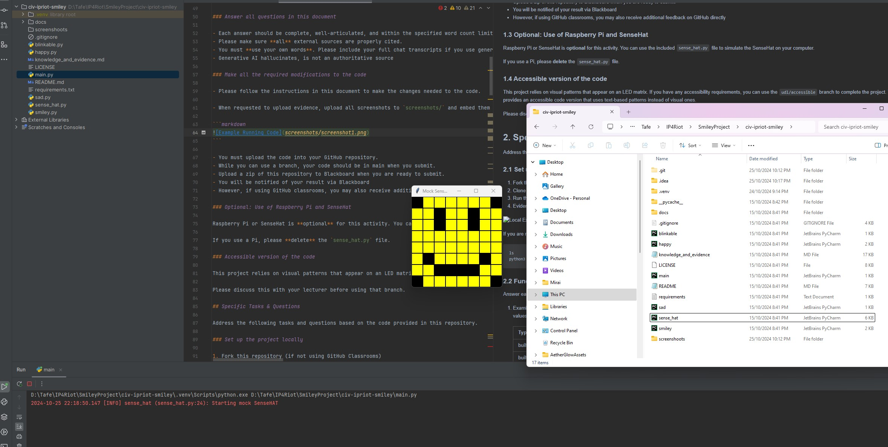
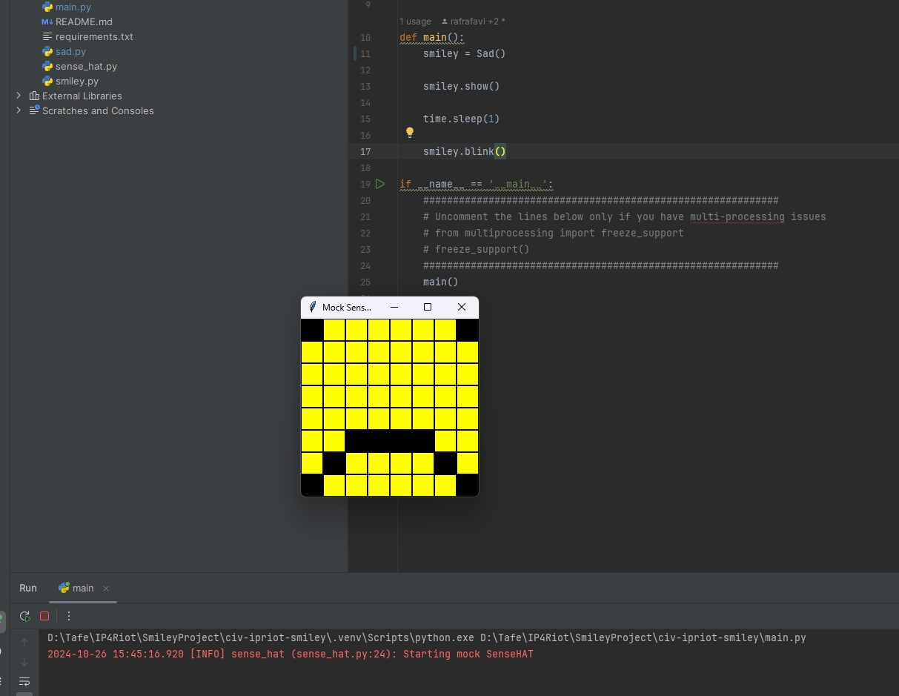

<style>

body {
    counter-reset: h2counter;
}

/* H1 - No numbering */
h1 {
    /* No counter reset or increment */
}

/* H2 - Level 1 numbering */
h2 {
    counter-reset: h3counter;
}

h2::before {
    counter-increment: h2counter;
    content: counter(h2counter) ". ";
}

/* H3 - Level 2 numbering */
h3 {
    counter-reset: h4counter;
}

h3::before {
    counter-increment: h3counter;
    content: counter(h2counter) "." counter(h3counter) " ";
}

/* H4 - Level 3 numbering (optional) */
h4 {
    counter-reset: h5counter;
}

h4::before {
    counter-increment: h4counter;
    content: counter(h2counter) "." counter(h3counter) "." counter(h4counter) " ";
}

</style>

# Evidence and Knowledge

This document includes instructions and knowledge questions that must be completed to receive a *Competent* grade on this portfolio task.

## Required evidence

### Answer all questions in this document

- Each answer should be complete, well-articulated, and within the specified word count limits (if added) for each question.
- Please make sure **all** external sources are properly cited.
- You must **use your own words**. Please include your full chat transcripts if you use generative AI in any way.
- Generative AI hallucinates, is not an authoritative source

### Make all the required modifications to the code

- Please follow the instructions in this document to make the changes needed to the code.

- When requested to upload evidence, upload all screenshots to `screenshots/` and embed them in this document. For example:

```markdown

```

- You must upload the code into your GitHub repository.
- While you can use a branch, your code should be in main when you submit.
- Upload a zip of this repository to Blackboard when you are ready to submit.
- You will be notified of your result via Blackboard
- However, if using GitHub classrooms, you may also receive additional feedback on GitHub directly

### Optional: Use of Raspberry Pi and SenseHat

Raspberry Pi or SenseHat is **optional** for this activity. You can use the included `sense_hat.py` file to simulate the SenseHat on your computer.

If you use a Pi, please **delete** the `sense_hat.py` file.

### Accessible version of the code

This project relies on visual patterns that appear on an LED matrix. If you have any accessibility requirements, you can use the `udl/accessible` branch to complete the project. This branch provides an accessible code version that uses text-based patterns instead of visual ones.

Please discuss this with your lecturer before using that branch.

## Specific Tasks & Questions

Address the following tasks and questions based on the code provided in this repository.

### Set up the project locally

1. Fork this repository (if not using GitHub Classrooms)
2. Clone your repository locally
3. Run the project locally by executing the `main.py` file
4. Evidence this by providing screenshots of the project directory structure and the output of the `main.py` file



If you are running on a Raspberry Pi, you can use the following command to run the project and then screenshot the result:

```bash
ls
python3 main.py
```

### Fundamental code comprehension

 Answer each of the following questions **as they relate to that code** supplied by in this repository (ignore `sense_hat.py`):

1. Examine the code for the `smiley.py` file and provide  an example of a variable of each of the following types and their corresponding values (`_` should be replaced with the appropriate values):

   | Type                    | name      | value         |
   | ----------              |-----------|---------------|
   | built-in primitive type | int       | 255           |
   | built-in composite type | tupple    | (255,255,255) |
   | user-defined type       | sense_hat | SenseHat()    |

2. Fill in (`_`) the following table based on the code in `smiley.py`:

   | Object                   | Type                        |
   | ------------             |-----------------------------|
   | self.pixels              | list[tupple[int, int, ...]] |
   | A member of self.pixels  | tupple                      |
   | self                     | instance of the class       |

3. Examine the code for `smiley.py`, `sad.py`, and `happy.py`. Give an example of each of the following control structures using an example from **each** of these files. Include the first line and the line range:

   | Control Flow | File     | First line | Line range |
   | ------------ |----------|------------|------------|
   |  sequence    | happy.py | 39         | 39-43      |
   |  selection   | sad.py   | 26         | 26-29      |
   |  iteration   | sad.py   | 16         | 16-17      |

4. Though everything in Python is an object, it is sometimes said to have four "primitive" types. Examining the three files `smiley.py`, `sad.py`, and `happy.py`, identify which of the following types are used in any of these files, and give an example of each (use an example from the code, if applicable, otherwise provide an example of your own):

   | Type                    | Used?     | Example                 |
   | ----------------------- |-----------|-------------------------|
   | int                     | smiley.py | WHITE = (255, 255, 255) |
   | float                   | happy.py  | delay = 0.25            |
   | str                     | Not used  | message = "Dear reader" |
   | bool                    | smiley.py | dimmed = True           |

5. Examining `smiley.py`, provide an example of a class variable and an instance variable (attribute). Explain **why** one is defined as a class variable and the other as an instance variable.

> Class Variables : WHITE, GREEN, RED, YELLOW, BLANK are the class variable.
> 
> Instance Variables : self.sense_hat, self.YELLOW, self.BLANK, self.pixels.
> 
> The constant values in smiley.py are declared in the class level because the value should never change. For that reason every instance can just refer to the same variable as the class variable is shared among all instances.
> 
> A smiley object should be able to express various emotion through pixels. Therefore, each smiley object needs to contain its own pixels data. This way when we instantiate multiple smiley objects, each instance can display its respective emotion.
>

6. Examine `happy.py`, and identify the constructor (initializer) for the `Happy` class:
   1. What is the purpose of a constructor (in general) and this one (in particular)?

   > Constructor is run when an object of the class is created. In general, they are used to initialize instance variables.
   > In the happy.py the constructor execute 2 functions. self.draw_mouth() and self.draw_eyes(). Both functions initialize pixels data define their respective shapes (eyes, mouth)

   2. What statement(s) does it execute (consider the `super` call), and what is the result?

   > In happy.py constructor, the super() is called. super() returns the object of the parent class so super().__init__() will call the parent's constructor.
   > 
   > In the parent's constructor (smiley.py). In the smiley's constructor, a sense hat object is created. The constructor also initialize pixels data that form a smiley.
   > The happy object will then proceed to run 2 of it's functions that define the mouth and eyes by altering the pixel at certain indexes.
   >

### Code style

1. What code style is used in the code? Is it likely to be the same as the code style used in the SenseHat? Give to reasons as to why/why not:
   
> The code style used is PEP8, which is the official coding style for Python. It's likely that SenseHat or any other module would use the same code style as steering from the official standard will make the code less readable for the public. An organization may have their own coding style but for libraries or public use, PEP8 should be followed.
>

2. List three aspects of this convention you see applied in the code.

> Constants are declared with capital letters allowing me to distinguish the variable from other non-constant variables.
> 
> Method definition are seperated with 1 blank lines, while class definition is seperated with 2 blank lines. By observing the spaces, I can better observe how each of the class are seperated.
>
> Class name use the CapWords convention, while function name should not contain any capital and seperated with _ . 
>

3. Give two examples of organizational documentation in the code.

> """
Renders a mouth by blanking the pixels that form that object.
""" The multi line comment provides documentation on what the function does.
> 
>  """
Draws the eyes (open or closed) on the standard smiley.
:param wide_open (bool): eyes open or closed.
""" This other example provides not only the description of the function but also explain the output of the parameters.
>

### Identifying and understanding classes

> Note: Ignore the `sense_hat.py` file when answering the questions below

1. List all the classes you identified in the project. Indicate which classes are base classes and which are subclasses. For subclasses, identify all direct base classes.
  
  Use the following table for your answers:

| Class Name | Super or Sub? | Direct parent(s)  |
|------------|---------------|-------------------|
| Blinkable  | Sub           | ABC               |
| Sad        | Sub           | Smiley            |
| Happy      | Sub           | Smiley, Blinkable |
| Smiley     | Super         |                   |

2. Explain the concept of abstraction, giving an example from the project (note "implementing an ABC" is **not** in itself an example of abstraction). (Max 150 words)

> Abstraction is a programing concept that hides the complexity and details of programming code from the users. 
> In the project, sense_hat module is used. We do not need to know how the module create the UI from the ground up.
> The module can be used just by reading relevant codes and comment to draw smiley.
>

3. What is the name of the process of deriving from base classes? What is its purpose in this project? (Max 150 words)

> Inheritance : A Smiley can have multiple expression and each expression can be defined in a subclass. By deriving from Smiley, the subclass will have everything the Smiley has. Each subclass can then have unique expression by setting altering the pixel data.
>

### Compare and contrast classes

Compare and contrast the classes Happy and Sad.

1. What is the key difference between the two classes?
   > Happy have a method to blink while Sad class don't. Happy implements multiple inheritance, Smiley and Blinkable while Sad only derives from Smiley
   >
2. What are the key similarities?
   > Both Happy and Sad inherit from Smiley class. On the constructor, Happy and Sad share the same code where both class run methods inherited from Smiley class (draw_mouth(), draw_eyes()).
   >
3. What difference stands out the most to you and why?
   > Happy derives from Blinkable where Sad does not. It's the only difference from both class apart from different values in the mouth variable.
   >
4. How does this difference affect the functionality of these classes
   > Happy class have inherited method to blink from Blinkable class. Sad class does not possess the blinkable method as it is not derived from BLinkable, therefore Sad class does not have the ability to blink.
   >

### Where is the Sense(Hat) in the code?

1. Which class(es) utilize the functionality of the SenseHat?
   > Smiley construct a sense hat object. It also has 2 methods that utilize sense hat, dim_display and show.
   > 
   > The two methods are called in the subclasses to show display smiley to the screen by calling the show() which execute set_pixels on the instance sense hat object.
   >
2. Which of these classes directly interact with the SenseHat functionalities?
   > The Smiley class show() method directly interact with sense hat functionalities. It calls the set_pixels method from the sense_hat object the instance created.
   >
3. Discuss the hiding of the SenseHAT in terms of encapsulation (100-200 Words)
   >  SenseHat has a private method _set_pixels(self, rgb_values). Private method and variables are form of encapsulation. The user does not need to know the full implementation of how SenseHat mock LED matrix pixel values. The user can just call the public method set_pixels and provide the required parameter.
   >

### Sad Smileys Can’t Blink (Or Can They?)

Unlike the `Happy` smiley, the current implementation of the `Sad` smiley does not possess the ability to blink. Let's first explore how blinking has been implemented in the Happy Smiley by examining the blink() method, which takes one argument that determines the duration of the blink.

**Understanding Blink Mechanism:**

1. Does the code's author believe that every `Smiley` should be able to blink? Explain.

> No, if every Smiley have the ability to blink then it make sense to just implement the method in Smiley class so any subclass will derive the Blink method.
> 
> The abstract class is used because not every Smiley needs to implement the blink method.
>

2. For those smileys that blink, does the author expect them to blink in the same way? Explain.

> No, the blink is an abstract method, therefore the blink method will be implemented in the class that derives from Blinkable. This way, every class can implements blink differently.
>

3. Referring to the implementation of blink in the Happy and Sad Smiley classes, give a brief explanation of what polymorphism is.

> If both Happy and Sad inherit from Blinkable, then the two classes will inherit the blink method. Polymorphism in this context is the same method blink, are callable on both of the class (Happy and Sad) even though the two are not the same type.
>

4. How is inheritance used in the blink method, and why is it important for polymorphism?

> The blink method is defined in Blinkable. Thus, any class that derive from Blinkable will inherit the blink method. It is important to declare the method in the abstract class (Blinkable), this way each class that derive from Blinkable have the power to implement its own blink method.
>
1. **Implement Blink in Sad Class:**

   - Create a new method called `blink` within the Sad class. Ensure you use the same method signature as in the Happy class:

   ```python
   def blink(self, delay=0.25):
       pass  # Replace 'pass' with your implementation
   ```

2. **Code Implementation:** Implement the code that allows the Sad smiley to blink. Use the implementation from the Happy Smiley as a reference. Ensure your new method functions similarly by controlling the blink duration through the `delay` argument.

3. **Testing the Implementation:**

- Test the new blink functionality on your Raspberry Pi or within the Python classes provided. You might need to adjust the `main.py` script to incorporate Sad Smiley's new blinking capability.

Include a screenshot of the sad smiley or the modified `main.py`:



- Observe and document the Sad smiley as it blinks its eyes. Describe any adjustments or issues encountered during implementation.

  > I changed the default delay value to 1 second, so the Sad Smiley closes its eye longer than when the Happy smiley.

  ### If It Walks Like a Duck…

  Previously, you implemented the blink functionality for the Sad smiley without utilizing the class `Blinkable`. Assuming you did not use `Blinkable` (even if you actually did), consider how the Sad smiley could blink similarly to the Happy smiley without this specific class.

  1. **Class Type Analysis:** What kind of class is `Blinkable`? Inspect its superclass for clues about its classification.

     > Blinkable is an abstract class as it is derived from ABC. Abstract class is meant to be implemented by other classes. Instantiating the abstract class itself will throw a run-time error.

  2. **Class Implementation:** `Blinkable` is a class intended to be implemented by other classes. What generic term describes this kind of class, which is designed for implementation by others? **Clue**: Notice the lack of any concrete implementation and the naming convention.

  > Abstract Class. There is no concrete methods in Blinkable as the methods should be implemented in the class that inherits from Blinkable.

  3. **OO Principle Identification:** Regarding your answer to question (2), which Object-Oriented (OO) principle does this represent? Choose from the following and justify your answer in 1-2 sentences: Abstraction, Polymorphism, Inheritance, Encapsulation.

  > Polymorphism, as the abstract methods are implemented in the subclass level.

  4. **Implementation Flexibility:** Explain why you could grant the Sad Smiley a blinking feature similar to the Happy Smiley's implementation, even without directly using `Blinkable`.

  > Because methods can be implemented inside any class.

  5. **Concept and Language Specificity:** In relation to your response to question (4), what is this capability known as, and why is it feasible in Python and many other dynamically typed languages but not in most statically typed programming languages like C#? **Clue** This concept is hinted at in the title of this section.

  > The concept is known as Duck typing. It is where a class or object is determined by its behavior (method and properties) rather than its explicit inheritance from a specific class or interface.
  > In Python or dynamically typed language, an object is not required to explicitly declare the types where in statically typed language, passing unrelated type will throw compiler error.

  ***

  ## Refactoring

  ### Does a Smiley Have to Be Yellow?

  While our current implementation predominantly features yellow smileys, emotional expressions like sickness or anger typically utilize colors like green, red, or orange. We'll explore the feasibility of integrating these colors into our smileys.

  1. **Defined Colors and Their Location:**

     1. Which colors are defined and in which class(s)?
        > WHITE, GREEN, RED, YELLOW, BLANK are defined in Smiley class
     2. What type of variables hold these colors? Are the values expected to change during the program's execution? Explain your answer.
        > Tuple of 3 integers, that represents an 8-bit RGB channel. (R = 255, G = 255 , B = 255)
     3. Add the color blue to the appropriate class using the appropriate format and values.
        > BLUE = (0, 0, 255)

  2. **Usage of Color Variables:**

     1. In which classes are the color variables used?
        > Sad, Happy and Smiley

  3. **Simple Method to Change Colors:**
  4. What is the easiest way you can think to change the smileys to green? Easiest, not necessarily the best!
     > On Smiley constructor, we can change Y = self.YELLOW to Y = self.GREEN

  Here's a revised version of the "Flexible Colors – Step 1" section for the smiley project, incorporating your specifications for formatting and content updates:

  ### Flexible Colors – Step 1

  Changing the color of the smileys once is straightforward, but it isn't very flexible. To facilitate various colors for smileys, it is advisable not to hardcode values in any class. This approach was identified earlier as a necessary change. Let's start by removing the built-in assumptions about color in our classes.

  1. **Add a method called `complexion` to the `Smiley` class:** Implement this instance method to return `self.YELLOW`. Using the term "complexion" instead of "color" provides a more abstract terminology that focuses on the meaning rather than implementation.

  2. **Refactor subclasses to use the `complexion` method:** Modify any subclass that directly accesses the color variable to instead utilize the new `complexion` method. This ensures that color handling is centralized and can be easily modified in the future.

  3. **Determine the applicable Object-Oriented principle:** Consider whether Abstraction, Polymorphism, Inheritance, or Encapsulation best applies to the modifications made in this step.

  4. **Verify the implementation:** Ensure that the modifications function as expected. The smileys should still display in yellow, confirming that the new method correctly replaces the direct color references.

  This step is crucial for setting up a more flexible system for color management in the smiley display logic, allowing for easy adjustments and extensions in the future.

  ### Flexible Colors – Step 2

  Having removed the hardcoded color values, we now enhance the base class to support dynamic color assignments more effectively.

  1. **Modify the `__init__()` method in the `Smiley` class:** Introduce a default argument named `complexion` and assign `YELLOW` as its default value. This allows the instantiation of smileys with customizable colors.

  2. **Introduce a new instance variable:** Create a variable called `my_complexion` and assign the `complexion` parameter to it. This step ensures that each smiley instance can maintain its own color state.

  3. **Rationale for `my_complexion`:** Using a distinct instance variable like `my_complexion` avoids potential conflicts with the method parameter names and clarifies that it is an attribute specific to the object.

  4. **Bulk rename:** We want to update our grid to use the value of complexion, but we have so many `Y`'s in the grid. Use your IDE's refactoring tool to rename all instances of the **symbol** `Y` to `X`. Where `X` is the value of the `complexion` variable. Include a screenshot evidencing you have found the correct refactor tool and the changes made.

  

  5. **Update the `complexion` method:** Adjust this method to return `self.my_complexion`, ensuring that whatever color is assigned during instantiation is what the smiley displays.

  6. **Verification:** Run the updated code to confirm that Smileys still defaults to yellow unless specified otherwise.

  ### Flexible Colors – Step 3

  With the foundational changes in place, it's now possible to implement varied smiley colors for different emotional expressions.

  1. **Adjust the `Sad` class initialization:** In the `Sad` class's initializer method, change the superclass call to include the `complexion` argument with the value `self.BLUE`, as shown:

     ```python
     super().__init__(complexion=self.BLUE)
     ```

  2. **Test color functionality for the Sad smiley:** Execute the program to verify that the Sad smiley now appears blue.

  3. **Ensure the Happy smiley remains yellow:** Confirm that changes to the Sad smiley do not affect the default color of the Happy smiley, which should still display in yellow.

  4. **Design and Implement An Angry Smiley:** Create an Angry smiley class that inherits from the `Smiley` class. Set the color of the Angry smiley to red by passing `self.RED` as the `complexion` argument in the superclass call.

  ***
